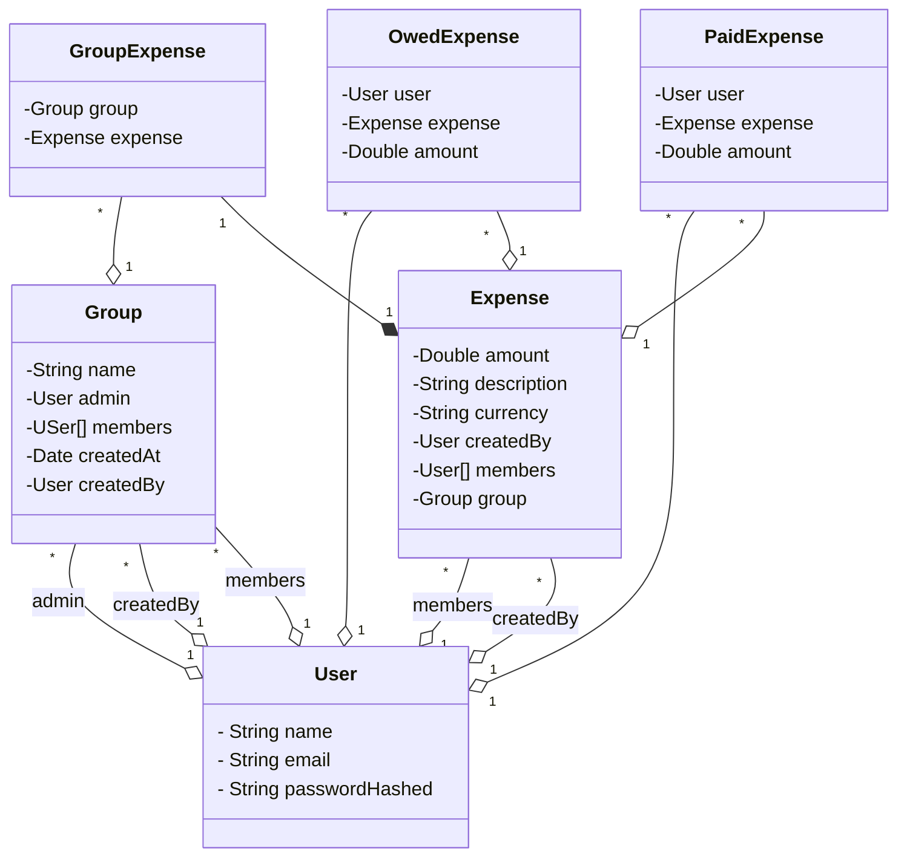

```mermaid
classDiagram
class User{
- String name
- String email
- String passwordHashed
}
class Expense{
-Double amount
-String description
-String currency
-User createdBy
-User[] members
-Group group
}
class Group{
-String name
-User admin
-USer[] members
-Date createdAt
-User createdBy
}
class GroupExpense{
-Group group
-Expense expense
}
class OwedExpense{
-User user
-Expense expense 
-Double amount 
}
class PaidExpense{
-User user
-Expense expense 
-Double amount 
}
Expense "*" --o "1" User : members
Expense "*" --o "1" User : createdBy
Group "*" --o "1" User : admin
Group "*" --o "1" User : createdBy
Group "*" --o "1" User : members
GroupExpense "*" --o "1" Group
GroupExpense "1"--*"1" Expense
OwedExpense "*" --o "1" User
OwedExpense "*" --o "1" Expense
PaidExpense "*" --o "1" User
PaidExpense "*" --o "1" Expense
```

