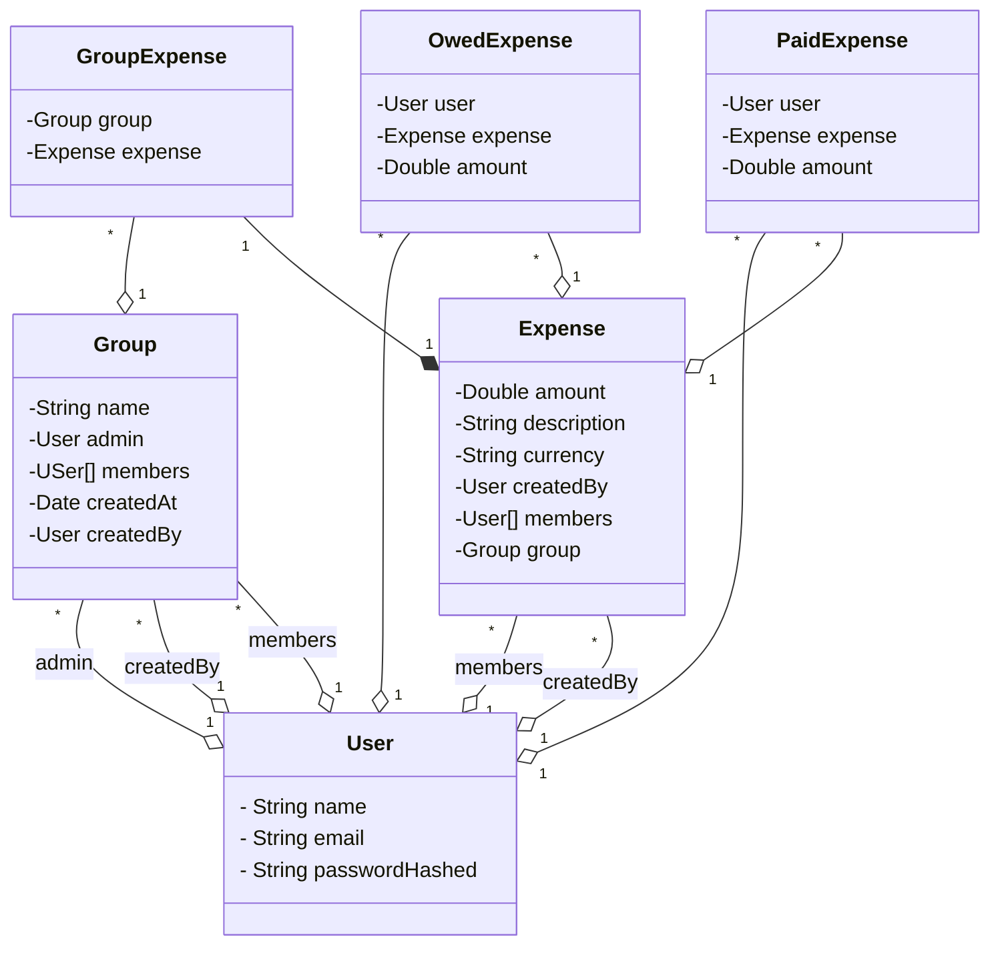

# Splitwise: Debt Simplification Engine
[Web site link](https://splitwise-5sfv.onrender.com)

A high-performance backend implementation designed to simplify complex debt structures and manage shared expenses across groups.

---

## 🏗️ Technical Architecture

### **Core Technology Stack**
* **Framework:** Java with Spring Boot
* **Persistence:** JPA / Hibernate (ORM)
* **Build & Dependency Management:** Maven
* **Testing:** JUnit 5 & Mockito
* **API Style:** RESTful Design

### **Architectural Patterns**
* **Layered Architecture:** Strict separation between Controllers, Services, and Repositories.
* **Dependency Injection:** Utilizing Spring’s IoC container for loosely coupled components.
* **Repository Pattern:** Abstracting data access for `Expense` and `User` entities.

---

## 🛠️ Core Responsibilities & Flow

### **1. Communication Layer (DTO Pattern)**
The system uses **Data Transfer Objects** to decouple the API contract from the internal database schema.
* **Inbound:** `CreateUserDto`, `CreateExpenseDto`
* **Outbound:** `GetUserDto` (Ensures sensitive data like passwords aren't leaked).

### **2. Business Logic (Service Layer)**
The "Brain" of the application, responsible for:
* **Debt Simplification:** Calculating who owes whom.
* **Group Management:** Handling user associations within specific expense contexts.
* **Currency Handling:** Managing international transactions via a dedicated `Currency` Enum.

### **3. Security & Encoding**
Built with flexibility in mind using **Interface Segregation**:
* **Interface:** `PasswordEncoder`
* **Implementation:** `BCryptEncoder` (Standardized hashing for user security).

---

## 📊 Data Modeling & JPA Relationships

The model uses a central **BaseModel** as an abstract class to ensure every table has consistent audit fields.

| Entity | Relationship | Description |
| :--- | :--- | :--- |
| **User & Group** | `@ManyToMany` | Users can belong to multiple groups; groups have many users. |
| **Expense & Group** | `@ManyToOne` | Multiple expenses belong to a single group context. |
| **Expense & User** | `@ManyToOne` | Links the individual who paid to the specific expense record. |

---

## 🧪 Testing Strategy

The project maintains high reliability by isolating dependencies:
* **Service Layer Testing:** Focused on `UserServiceTest`.
* **Mocking:** Using **Mockito** to simulate Repository responses, ensuring tests are fast and independent of the database.
* **Assertions:** **JUnit 5** for verifying business logic outcomes and edge cases.

---

## 🚀 Scalability & Extensibility
* **Modular Services:** New features (like settling up via UPI/PayPal) can be added by implementing new service interfaces.
* **Database Agnostic:** Thanks to JPA/Hibernate, the underlying SQL engine can be swapped with minimal configuration changes.

## Class Diagram

